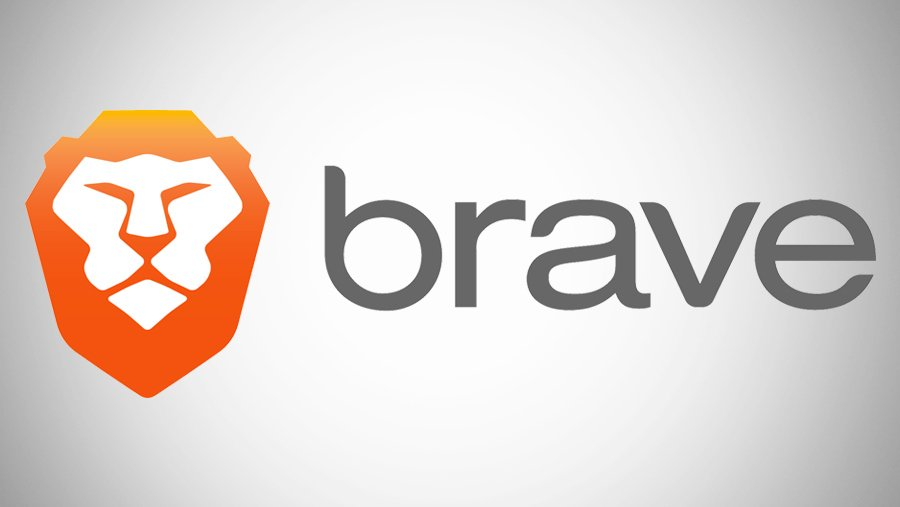
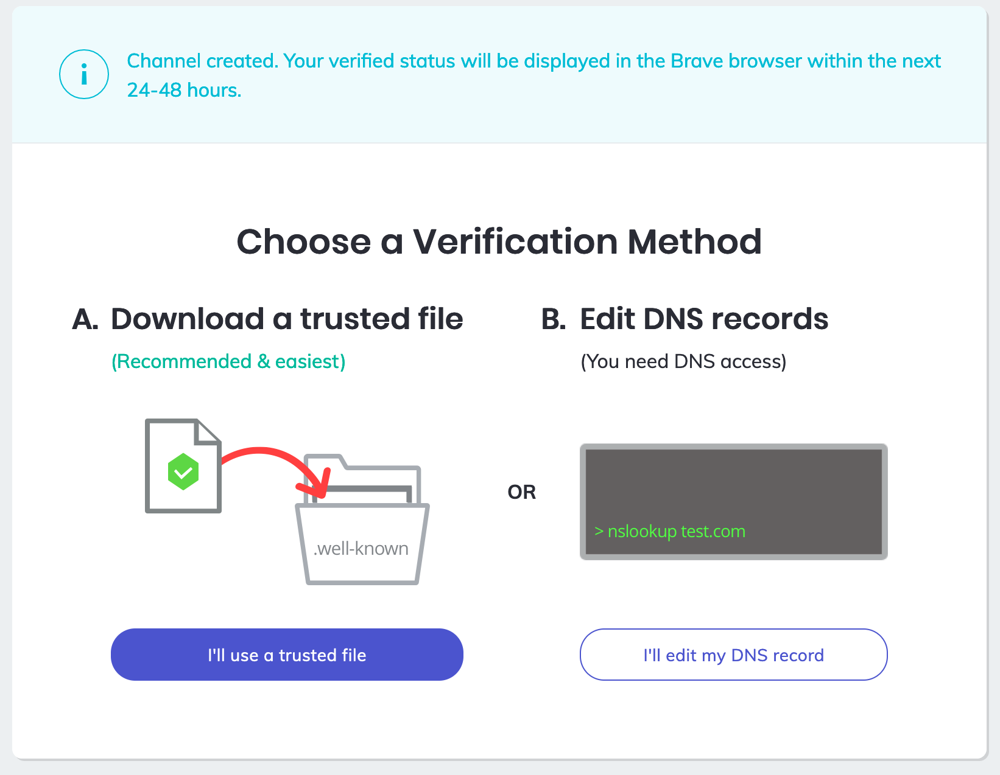

Internet advertising is generally pretty awful. The first thing I install when I set up a new web browser is an ad blocker (I used uBlock Origin). I find it's a must as many websites are so full of ads that they can be almost unusable. Moreover, I’m not keen on the whole surveillance capitalism model of ubiquitous tracking and micro targeting. It’s pretty clear to me that traditional Internet advertising is broken.

Recently, I was working on a side project and wanted to experiment with running some privacy-friendly ways of earning revenue. I knew of [Coil](https://coil.com/) and Brave, but ultimately decided to go with Brave. 

### About Brave

[Brave](https://brave.com/) is a privacy focused web browser based on the same Chromium engine that powers Google Chrome. The primary advantage of Brave is that it strips out the Google-related features and adds robust ad blocking technology. Brave claims this results in a browsing experience that is up to 35% faster as it significantly reduces the number of ads and trackers appearing on websites.

While I haven’t analyzed Brave systematically, it does feel like a faster browser. When comparing to Google Chrome without an ad blocker installed, visiting the same websites in Brave results in ad-free websites that load quickly. I tried this on ad-heavy websites such as local television websites and found that most ads are blocked. Third party studies have also found that [Brave is one of the more privacy-friendly browsers](https://www.ghacks.net/2020/02/25/study-finds-brave-to-be-the-most-private-browser/) when using its default settings. 

### Brave Rewards

While Brave blocks traditional invasive advertisements, it has also developed an alternative model for Internet advertising. This system centers on what Brave calls a [Basic Attention Token](https://basicattentiontoken.org/) (BAT). BAT is “a utility token for a new, blockchain-based digital advertising and services platform.” Brave users who opt-in to Brave Rewards can earn BAT for viewing ads in their browser (shown as system notifications). You can adjust the frequency for viewing ads by choosing to see between 1 and 5 ads per hour. Once you have earned payment in BAT, you can cash it out to regular currency or use it to contribute to creators. 

Brave estimates that the average user will earn around $5 per month. Users have the ability to either use the auto-contribution model or to adjust which sites receive a share of their BAT each month. You can also use cash to purchase BAT, which can then be used to tip creators. 

Over time, Brave learns users preferences and attempts to show more relevant ads. This is done on the user’s device and according to Brave “the information Brave Ads to decide which ads to show stays safely on your device and is never shared with anyone, even Brave.” This is very different than the constant profiling and surveillance done by the larger Internet advertising industry. I will say that in my testing I haven’t seen particularly relevant advertising. The majority has been for various crypto companies.

### Configuring Brave Rewards as a Publisher

As a publisher, you need to sign up as a [Brave Creator](https://creators.brave.com/). The process is straight forward. You add your website and then Brave attempts to auto-detect how best to add the verification code. If you are using a WordPress, it will recommend [a verification plugin](https://wordpress.org/plugins/brave-payments-verification/). For sites not using WordPress, you can either create a file in the `.well-known` directory or add a DNS record.

There are [minimal guidelines](https://support.brave.com/hc/en-us/articles/360029235132-BAT-Creator-Grant-Guidelines) for being accepted in the program. Most of them focus on preventing fraudulent methods of earning BAT. There is a longer “[Terms of Service](https://basicattentiontoken.org/publisher-terms-of-service/)” that may be worth reading. 

To get paid, you will need to verify with either Uphold or Gemini, two wallets integrated with Brave. Once you do that, Brave will pay you monthly for earnings. These earnings will be either proportioned tips based on your share of the user’s attention (as auto-calculated via Brave) or [one-time tips](https://brave.com/tips/) granted by the visitor. 

As of this writing, Brave claims that their system has [30 million monthly active users](https://brave.com/transparency), 10 million daily active users, and 1 million verified creators. I wouldn't expect the average website will earn a lot from Brave, as it doesn’t have near the market share of other browsers. However, it does offer an alternative way of earning ad revenue. 
