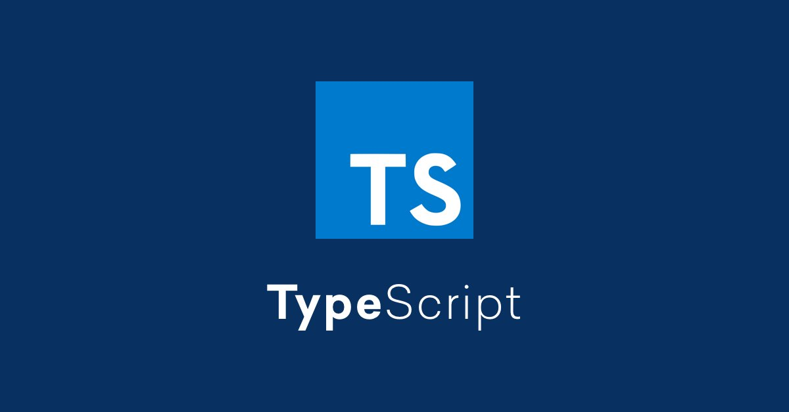

I recently upgraded this site – which is built using GatsbyJS – to use TypeScript. For those who haven’t used it, TypeScript is a superset of JavaScript that adds type-checking. One of the benefits of TypeScript is that can prevent JavaScript bugs that happen due to JavaScript’s type coercion. A basic example would be:

```javascript
let total = 2 + ‘2’
typeof total;
```

JavaScript will report the value as ‘22’ and it will be a string, rather than a numeric value. If you have code that depends on this being a number, it will cause errors. In TypeScript, we can fix this by declaring that `total` is a number:

```javascript
let total: number = 2 + ‘2’
```

TypeScript will give an error as we are writing the code as we are attempting to add a number and a string. This allows us to catch the bug and put in the proper safeguards. In addition, implementing TypeScript allows for better intellisense and in many cases, VSCode will be able to help identify properties on objects, preventing an additional class of errors. 

### Using TypeScript in GatsbyJS

[GatsbyJS supports TypeScript out of the box](https://www.gatsbyjs.com/docs/how-to/custom-configuration/typescript) and recommends an incremental approach. This means that you can start file-by-file, converting the `.js` files in your Gatsby project to `.tsx` as time allows. This makes the prospect of moving to TypeScript much easier.

That said, to get the most out of TypeScript in GatsbyJS, you will want to install a variety of different packages to improve the type checking and maximize the benefits.
 
### Installing Packages

To get up and running with TypeScript, we’ll need to install several packages including TypeScript, Prettier, and ESLint. You can do this in one command with:

```bash
npm install --dev typescript eslint eslint-loader gatsby-plugin-eslint eslint-plugin-react eslint-plugin-prettier eslint-config-prettier @typescript-eslint/eslint-plugin @typescript-eslint/parser
```

Note: I encountered several tutorials that recommend using TSLint despite it being deprecated in 2019 in favor of ESLint.

### Installing GatsbyJS TypeScript Plugins

To use TypeScript in GatsbyJS, I added three plugins:

```bash
npm install gatsby-plugin-typescript gatsby-plugin-typescript-checker gatsby-plugin-eslint
```

The first allows us to use TypeScript with GatsbyJS while the second adds type checking to the console output. In simple terms, this means that as we develop using `gatsby develop` we will see type errors in the terminal output. The third will allow GatsbyJS to work ESLint.

### Adding Types

We’ll also need to add some type definitions, starting with the following:

```bash
npm install -save-dev @types/react @types/react-dom @types/react-helmet
```

Depending on your setup, you may need to install additional types. On this site, I added types for Styled Components and React Burger Menu:

```bash
npm install save-dev @types/styled-components @types/react-burger-menu
```

You can find types for additional packages via Google.

I ran into some problems with imported SVGs in TypeScript, which I solved by creating a `custom.d.ts` file in the root of my project and adding the lines:

```javascript
declare module "*.svg" {
  const src: string
  export default src
}
```

### Configuring GatsbyJS and TypeScript

In order to get GatsbyJS working with TypeScript, we’ll need to make several configuration changes now that we have the required packages installed.

I edited `gatsby-config.js` and added the following:

```javascript
    `gatsby-plugin-typescript`,
    `gatsby-plugin-typescript-checker`,
    {
      resolve: "gatsby-plugin-eslint",
      options: {
        // Gatsby required rules directory
        rulePaths: [gatsbyRequiredRules],
        // Default settings that may be ommitted or customized
        stages: ["develop"],
        extensions: ["js", "jsx", "ts", "tsx"],
        exclude: ["node_modules", "bower_components", ".cache", "public"],
        // Any additional eslint-webpack-plugin options below
        // ...
      },
    },
```

Next, you will want to create a `tsconfig.json` file to hold your TypeScript settings. A basic default example can be found in [Gatsby’s “using-typescript” repo](https://github.com/gatsbyjs/gatsby/blob/master/examples/using-typescript/tsconfig.json):

```javascript
{
  "include": ["./src/**/*"],
  "compilerOptions": {
    "target": "esnext",
    "module": "esnext",
    "lib": ["dom", "es2017"],
    // "allowJs": true,
    // "checkJs": true,
    "jsx": "react",
    "strict": true,
    "esModuleInterop": true,
    "experimentalDecorators": true,
    "emitDecoratorMetadata": true,
    "noEmit": true,
    "skipLibCheck": true
  }
}
```

After that, install and configure Prettier for code formatting. You can install the package using:

```bash
npm i -D prettier
```

If there isn’t already a `prettier.rc` file in your project root, you can create one with the following settings:

```javascript
{
  "endOfLine": "lf",
  "semi": false,
  "singleQuote": false,
  "tabWidth": 2,
  "trailingComma": "es5"
}
```

After that, we’ll configure VSCode to use Prettier. We can do this by editing VSCode’s `settings.json` file and adding the following:

```javascript
// settings.json rules for prettier
{
  "editor.defaultFormatter": "esbenp.prettier-vscode",
  "[javascript]": {
    "editor.defaultFormatter": "esbenp.prettier-vscode",
    "editor.formatOnSave": false
  },
  "[javascriptreact]": {
    "editor.defaultFormatter": "esbenp.prettier-vscode",
    "editor.formatOnSave": false
  },
  "[typescript]": {
    "editor.defaultFormatter": "esbenp.prettier-vscode",
    "editor.formatOnSave": false
  },
  "[typescriptreact]": {
    "editor.defaultFormatter": "esbenp.prettier-vscode",
    "editor.formatOnSave": false
  }
}
```

Lastly, we’ll create the file `.eslintrc.js` in our project root. This is a good starting configuration:

```javascript
// basic .eslintrc.js compatible with react prettier and typescript
module.exports = {
  // Specifies the ESLint parser for TypeScript
  parser: "@typescript-eslint/parser",
  extends: [
    "plugin:react/recommended",
    "plugin:@typescript-eslint/recommended",
    "prettier/@typescript-eslint",
    "plugin:prettier/recommended",
  ],
  settings: {
    react: {
      version: "detect",
    },
  },
  env: {
    browser: true,
    node: true,
    es6: true,
  },
  plugins: ["@typescript-eslint", "react", "prettier"],
  parserOptions: {
    ecmaFeatures: {
      jsx: true,
    },
    // Allows for the parsing of modern ECMAScript features
    ecmaVersion: 2018,
    // Allows for the use of imports
    sourceType: "module",
  },
  rules: {
    // Disable prop-types as we use TypeScript for type checking
    "react/prop-types": "off",
    "@typescript-eslint/explicit-function-return-type": "off",
    // Enable prettier rules
    "prettier/prettier": "error",
    // interface start with capital I
    "@typescript-eslint/interface-name-prefix": "off",
    // allow "any" as type
    "@typescript-eslint/no-explicit-any": "off",
    // allow @ts-ignore for testing purposes
    "@typescript-eslint/ban-ts-ignore": "off",
  },
};
```

As we did with Prettier, we’ll adjust the VSCode `settings.json` file to use ESLint:

```javascript
// settings.json rules for ESLint
{
  "eslint.autoFixOnSave": true,
  "eslint.validate": [
    "javascript",
    "javascriptreact",
    {
      "language": "typescript",
      "autoFix": true
    },
    {
      "language": "typescriptreact",
      "autoFix": true
    }
  ]
}
```

### Converting to TypeScript

Once you have the setup done, you can start converting your components and pages to TypeScript. I did this by renaming files and then seeing what broke and correcting each component. A helpful guide if you get stuck are [the React TypeScript Cheatsheets](https://react-typescript-cheatsheet.netlify.app/).

### Wrapping Up

Given that this is a small personal site, I was able to complete the conversion to TypeScript in a couple of evenings. I don’t believe that the conversion has caught any significant bugs, but it was a nice practice exercise. Going forward, I’ll be writing any new features and components on the site using TypeScript.