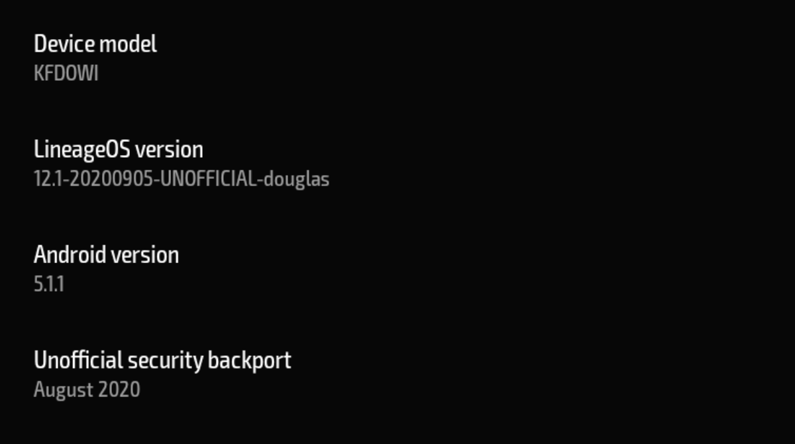
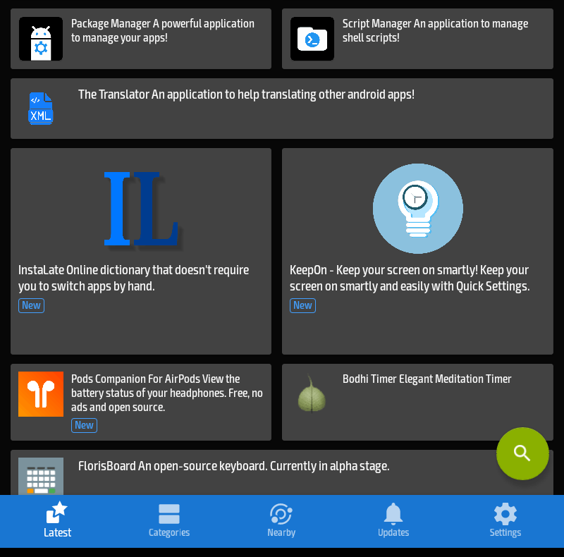

A few years back I purchased [an Amazon Fire HD](https://foundation.mozilla.org/en/privacynotincluded/amazon-fire-hd-tablets/) in order to have a tablet sized device to test websites on. I’ve always found it easier to test on a physical device, so the Fire HD was a cheap way to do that. Given the low price and the hardware, I wasn’t entirely surprised to learn that it was pretty slow, making me wonder how people are able to use such a device for daily browsing. 

Outside of the speed, I had a lot of privacy concerns. When purchased, the Amazon Fire HD low cost is subsidized by its total integration into the Amazon ecosystem. Everything about the interface and operating system (a modified version of Android called FireOS) is design to get you to purchase products from Amazon. Amazon also syphons as much data as it can from you and your device, encouraging you to login with an Amazon account and using a default web browser called Silk that [relies on cloud integration](https://searchsecurity.techtarget.com/tip/Examining-Kindle-Fire-security-Silk-browser-security-in-the-enterprise) to try to offset the slow on tablet performance. They also sell a cheaper version with ads that appear on the lock screen and while they happily remove them if you just chat with support and say that you were offended by an ad, the whole package is a rather creepy.

At the time I did what I could to mitigate the data collection. I registered the tablet with a new Amazon account tied to a new email. While it meant trading Amazon for Google in some ways, I [installed the Google Play Store on the Fire](https://www.androidpolice.com/2020/12/25/install-play-store-amazon-fire-tablet/) in order to add apps outside of Amazon’s very limited app store. I replaced Amazon’s Silk browser with [Firefox Focus](https://support.mozilla.org/en-US/kb/focus). Most importantly, I installed [a firewall called NetGuard](https://netguard.me/) and turned off network access to everything but the apps I needed to use. After this it became a good enough device for testing the occasional website, but I never really did much else with it.

### Third Party Android ROMs for the Kindle Fire HD

I didn’t really use the Kindle Fire for much, but I kept an eye out on the XDA Forums hoping for a day when someone would figure out how to replace Amazon’s FireOS with a different version of Android. There were some early attempts that involved physically modifying the hardware which was a bit more than I wanted to try. 

In early 2020 I came across a process for [unlocking the bootloader and installing a custom recovery](https://forum.xda-developers.com/t/unlock-root-twrp-unbrick-fire-hd-8-2017-douglas.3962846/) on the Kindle Fire HD. The process worked on my hardware (an Amazon Kindle Fire HD 2017 - codename “Douglas”) and promised that in the end I would be able to install a custom version of Android. Looking at the options, there were two version of Android I could install, both of which were based on v5.1 of Android (which is the same as what FireOS was built on). The options were [an unofficial build](https://forum.xda-developers.com/t/rom-unlocked-douglas-lineage-12-1-5-sep-2020.3967537/) of [LineageOS](https://lineageos.org/) and [SlimLP](https://forum.xda-developers.com/t/rom-unlocked-douglas-slimlp-10-jan-2020.3996003/). I have had positive experiences in the past with LineageOS, so I went that route and downloaded the ROM. 

### Unlocking the Kindle Fire HD Bootloader and Installing Android

After downloading the LineageOS 12.1 ROM for the Kindle Fire HD, the next step is to [unlock the bootloader](https://forum.xda-developers.com/t/unlock-root-twrp-unbrick-fire-hd-8-2017-douglas.3962846/). This involves temporarily “bricking” (rendering it unusable) the tablet, so it is possible that you could make your tablet unusable. At the time I did this, the Kindle Fire HD was running FireOS v5.6.3.x. In order to do this, you will need a micro-USB cable to connect the tablet to your computer and a Linux environment. I used a computer that had an install of Ubuntu, but you could also use [an Ubuntu live installation via a USB stick](https://ubuntu.com/tutorials/try-ubuntu-before-you-install#1-getting-started).

Once you boot into Linux, you will need to open a terminal and run the following commands to install the required software:

```shellsession
sudo apt update
sudo add-apt-repository universe
sudo apt install python3 python3-serial adb fastboot dos2unix
```

You will also need to download the files [amonet-douglas-v1.2.zip](https://forum.xda-developers.com/attachments/amonet-douglas-v1-2-zip.4845269/), [brick-douglas.zip](https://forum.xda-developers.com/attachments/brick-douglas-zip.4825253/), and [MTK-su.zip](https://forum.xda-developers.com/t/rapid-temporary-root-for-hd-8-hd-10.3904595/) from [the XDA post](https://forum.xda-developers.com/t/unlock-root-twrp-unbrick-fire-hd-8-2017-douglas.3962846/) announcing the method. The instructions from [the post](https://forum.xda-developers.com/t/unlock-root-twrp-unbrick-fire-hd-8-2017-douglas.3962846/page-32#post-84047455) are:

#### Reboot FireHD8 to Recovery (Power Off device, then hold VolUp + Power)

    1. Select Factory Reset then Wipe Cache
    2. Reboot to Bootloader
    3. You will see the black screen with “Fastboot” in the lower corner.
    4. Open Terminal from “brick-douglas” folder and type `sudo ./brick.sh` 
    5. Check Display output for the “Disconnect USB and Powerdown” Message and do so when prompted
    6. Open Terminal from “amonet-douglas-v1.2” folder.
    7. Enter “sudo ./bootrom-step.sh"
    8. Reconnect USB
    9. Wait until the bootrom step is finished
    10. Enter `sudo ./fastboot-step.sh`
    11. You will end up in TWRP 

Once this process is completed and you are in [TWRP](https://twrp.me/) (an alternative bootloader for Android devices), you can install LineageOS. I copied it over to a microSD card on the Kindle Fire HD and then selected “Format Data and Wipe” within TWRP and ran that on /data, /system, and /cache. Once that was done you install LineageOS by selecting the zip file containing the ROM and then reboot.



### Configuring LineageOS

After the successful reboot into LineageOS 12.1, it is time to configure the system. I wanted to stay away from the kind of spyware and junk that made me nervous about FireOS initially, so I decided against installing any Google Services. Instead, I decided to use [F-Droid](https://f-droid.org/) as my primary app source. 

To install F-Droid you can download the APK from their site and install it. You will need to go to “Settings > Security” and select “Unknown Sources” to allow the installation of apps from unknown sources. After installing F-Droid I installed the following apps:

* [Aurora Store](https://f-droid.org/en/packages/com.aurora.store/) – This app spoofs the Google Play Store and allows you to download apps from the Google Play Store. This is useful for getting apps that aren’t on F-Droid.
* [Handy News Reader](https://f-droid.org/en/packages/ru.yanus171.feedexfork/) – A nice RSS reader
* [Librera Reader](https://f-droid.org/en/packages/com.foobnix.pro.pdf.reader/) – Allows you to read books and PDFs

Using the newly installed Aurora Store, I installed [Brave Browser](https://brave.com/). I have found that Brave seems to run the best on the tablet (I haven’t done any tests, this is purely a subjective assessment). It has built-in ad and tracker blocking which probably helps with the speed.

I also wanted support for “dark mode” which unfortunately isn’t a native part of LineageOS v12.1 since it is based on the older Android v5.1 system. To do this you can install a custom theme. I went with “Pitchblack | DarkRed CM13/12 Theme” installed via Aurora. This gives the Kindle Fire HD a usable dark theme. It unfortunately changes some of the system icons into less familiar icons, but I think it’s a worthwhile trade-off.

### Conclusion

Following this process has left me with a Kindle Fire HD that is much faster than the stock version. It takes a device full of Amazon spyware and strips out all of the Amazon bloat and gives you a basically stock Android experience. It has made using the tablet for testing websites considerably better and also has allowed me to use it as an e-reader device that isn’t as creepy as a stock Kindle. I still wouldn’t trust the Kindle Fire for anything sensitive – unfortunately one of the limitations of this route is that it doesn’t support encryption – but I think it is useful process. 

**Note: There is a [newer version of LineageOS](https://forum.xda-developers.com/t/rom-unlocked-douglas-otas-lineage-14-1-30-jan-2021.4195349/) for the Kindle Fire HD. It is LineageOS v14.1 (based on Android v7.1.2). I haven’t upgraded yet due to some limitations in that ROM, but it is another option.**
