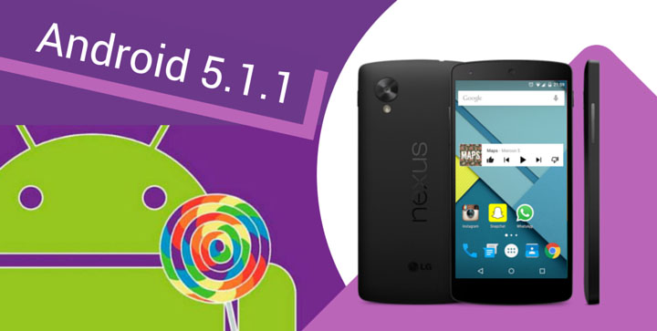

I like to keep various old Android devices around to test websites on different devices and screen sizes when developing websites. Testing a site on a physical device gives insight into how a website performs in a way that simply adjusting the screen size of a browser window.

Recently while testing on an older Android device (5.1.1), I ran into an issue where I accidentally changed the USB setting to "Charging Mode Only." This turns off the ability to connect to the Android device and transfer files (Media Device – MTP). For some reason on this particular device, turning on the setting disabled the ability to reenable access to the device via USB and it was stuck in “Charging Mode.” The issue persisted when I rebooted the device. I tried to enable “Developer Options” (enabled by going to Settings > About and clicking on “Build Number” seven times, but the USB option could not be toggled there either.

I had some difficulty figuring out how to fix this. I tried a few apps supposedly designed to reenable the setting, but they didn’t work. I did some research and narrowed down the issue to the persist.sys.usb.config file. On this particular device I was running a custom ROM and recovery, so I booted into recovery ([TWRP](https://twrp.me/)). From there I went to `Advanced > File Manager` and navigated to `/data/property`. Once in that directory, I was able to click on the `/data/property/persist.sys.usb.config` file which pulls up a menu allowing it to be deleted. I chose to delete the file, but you could also rename it by adding .bak to the extension for extra safety.

Deleting the file and rebooting restored the USB file transfer functionality and I once again had a functional – albeit very old – Android device to use as a test device.