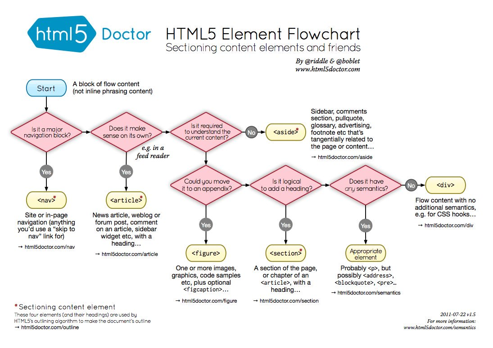

Part of my reason for wanting to start a blog was to have an easy place to store useful development resources that I come across. I have tried to do that with Twitter, but it's easy for things to get lost amid all the cruft. 

At any rate, I'm putting this chart here because it's a helpful reminder to myself to remember to always use semantic elements. In a world where we're so often encouraged to just throw a DIV on the page, it seems useful.