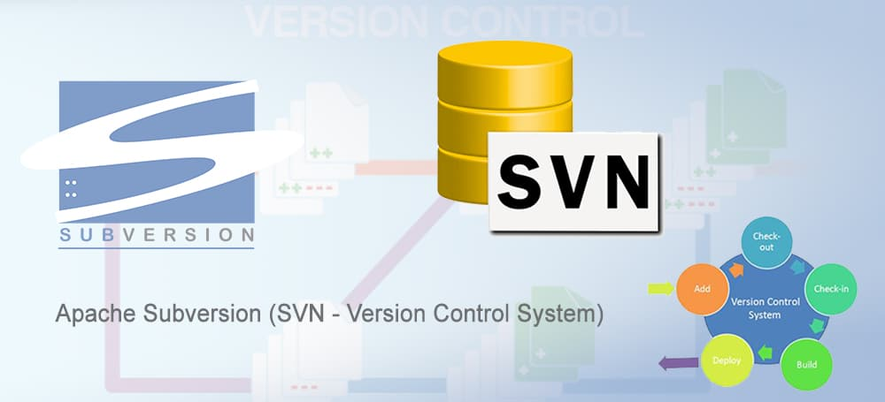

I recently created and published [a small WordPress plugin](https://wordpress.org/plugins/details-show-and-hide) on [the WordPress.org Plugin Directory](https://wordpress.org/plugins/). In order to release the plugin, you need to use Subversion (SVN). It had been years since I used Subversion and had to reacquaint myself with the process. When a plugin is approved, WordPress sends [a guide to using Subversion](https://developer.wordpress.org/plugins/wordpress-org/how-to-use-subversion/), but I found it to be a little confusing. What follows are my notes on setting up Subversion.

## Installing Subversion

The documentation shared by WordPress.org mentions some graphical clients, but there isn’t a clear recommendation on what to use. Additionally, the instructions later on in the documentation assume that you have the command line Subversion.

Since I’m comfortable working with Git, I decided to go with the command line version. I’m on macOS, so I used [Brew](https://brew.sh/). If you don’t already have Brew, you will need to install it by running:

```shellsession
/bin/bash -c "$(curl -fsSL https://raw.githubusercontent.com/Homebrew/install/HEAD/install.sh)"
```

Once Brew is installed, you can install Subversion by using:

```shellsession
brew install svn
```

## Releasing a New WordPress Plugin with Subversion

Once Subversion is installed, you can use it via the CLI. I created a new directory in my development directory called `release` for my code.

In the plugin approval email from WordPress, you will have received a plugin an address for a Subversion repository on plugins.svn.wordpress.org. To initialize the repository on your local machine, you can run:

```shellsession
svn co WP_ORG_SUBVERSION_LINK_HERE LOCAL_DIRECTORY_HERE
```

Once you do that, you can copy your plugin files to `trunk/`. When the files are copied, run this command to add the files:

```shellsession
svn add trunk/*
```

You can then commit the changes. You can replace `WP-USERNAME` with your WordPress.org username (this is necessary unless your computer has the same username):

```shellsession
svn --username=WP-USERNAME ci -m "Check in v1.0"
```

Once you have done that, you will want to copy the files from trunk to corresponding tagged release and check that in:

```shellsession
svn cp trunk tags/1.0.0
svn ci -m "Tagging version 1.0.0"
```

Lastly, you will want to copy your WordPress.org assets (plugin banner, icon, and screenshots) to the `/assets` folder. After doing that, you can commit those:

```shellsession
svn add assets/*
svn ci -m "Add assets"
```

Now that the code has been added, you should be able to view your plugin on WordPress.org within a few minutes.
